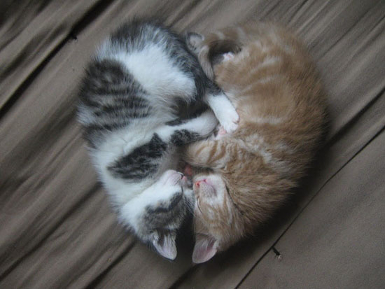

# Stenin hoito-ohjeet

Tämä dokumentti pitää sisällään ohjeet Stenin hoitamista varten ystäville ja vaimolle. Ohjeet toimivat avoimen lähdekoodin periaatteita noudattaen, eli kaikki lisäykset sekä muutokset ohjeisiin ovat enemmän kuin tervetulleita aina kun huomaatte ohjeissa jotain puutteita.

## Ohjeet

### Älä pese yli 60 asteessa ja silitä usein.

### Komppa hölmöyksiä

### Kun Sten tekee aikatauluja muista kertoa aikatauluarvio piillä

### Ruoki nälkäisenä

### Aina välillä, muista juonia Stenin ystävien kanssa Stenin pään menoksi

### Jos suru tai kiukku yllättää, hali ja mussukoi

### Myös hyvällä tuulella, muista halia ja mussukoida

### Jos lentokone tippuu taivaalta niin pelasta Sten ensin ja sitten vasta itsesi. En pärjää ilman <3

## Lisenssi

## Github

Muokkaa minua GitHubissa: [https://github.com/jnissin/stenin-hoito-ohjeet](https://github.com/jnissin/stenin-hoito-ohjeet)